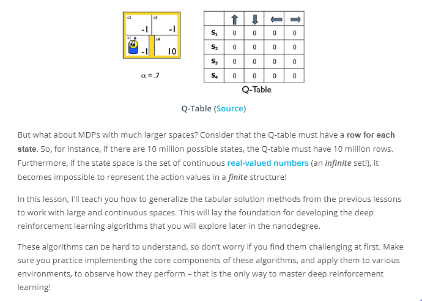
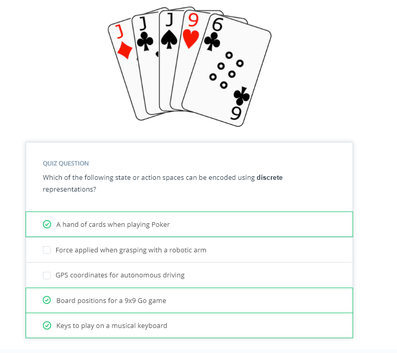
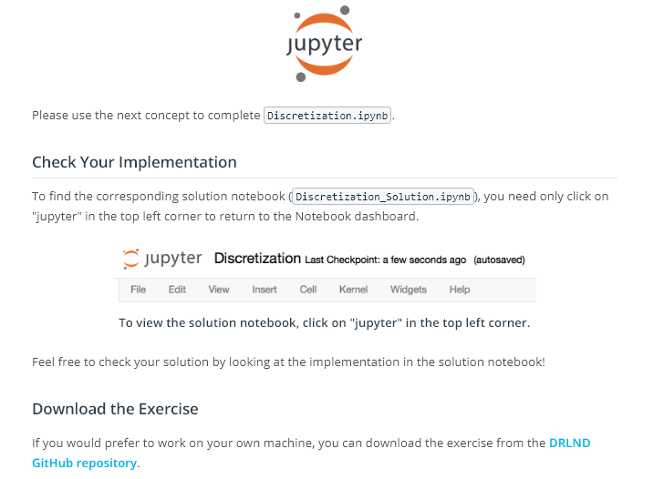
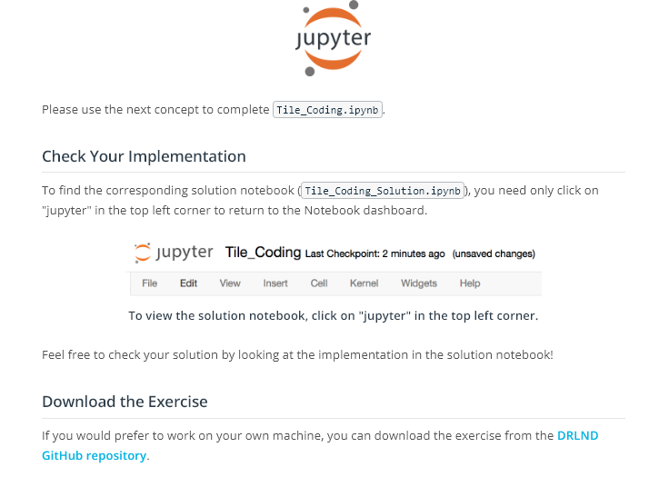
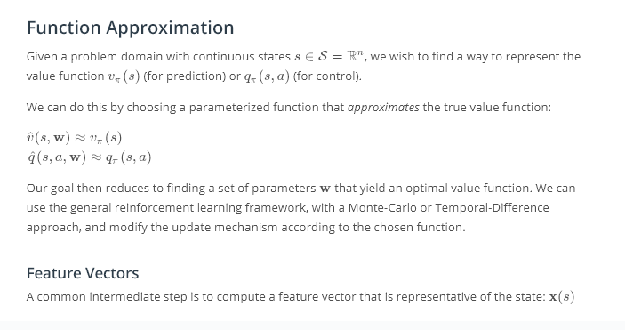

# RL in Continuous Spaces

## Concepts
1. Introduction
	
	
1. [Lesson Overview](https://www.youtube.com/watch?v=GPjK124RU5g)
1. [Discrete vs. Continuous Spaces](https://www.youtube.com/watch?v=uHstLeRzaE8)
1. Quiz: Space Representations
	
1. [Discretization](https://www.youtube.com/watch?time_continue=1&v=j2eZyUpy--E)
1. Exercise: Discretization
	
1. [Tile Coding](https://www.youtube.com/watch?v=BRs7AnTZ_8k)
1. Exercise: Tile Coding
	
1. [Coarse Coding](https://www.youtube.com/watch?v=Uu1J5KLAfTU)
1. [Function Approximation](https://www.youtube.com/watch?v=UTGWVY6jEdg)
	
1. [Linear Function Approximation](https://www.youtube.com/watch?v=OJ5wrB7o-pI)
1. [Kernel Functions](https://www.youtube.com/watch?v=RdkPVYyVOvU)
1. [Non-Linear Function Approximation](https://www.youtube.com/watch?v=rITnmpD2mN8)
1. [Summary](https://www.youtube.com/watch?v=MTEBk43oByU)