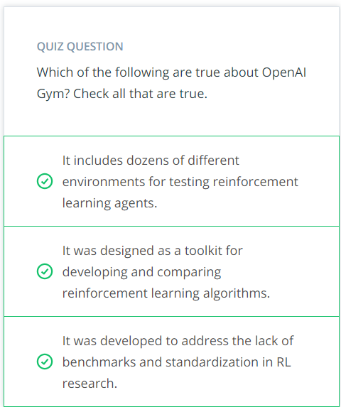

## OpenAI Gym
In this course, we’ll make extensive use of [OpenAI Gym](https://gym.openai.com/), an open-source toolkit created by [OpenAI](https://openai.com/) for developing and comparing reinforcement learning (RL) algorithms. Using this toolkit, you will teach your own agents to accomplish a variety of complex tasks.

We'll use it to build practical, hands-on skills with many of the algorithms that we'll learn about during the nanodegree. Then, once you build your confidence with these environments, you'll be more than ready to tackle the projects!

## Take a Look
You can take a look at some of the environments that OpenAI Gym offers from the link [here](https://gym.openai.com/envs/).

If you'd like to learn more about OpenAI Gym, please peruse the [GitHub repository](https://github.com/openai/gym.git). Check out this [blog post](https://blog.openai.com/openai-gym-beta/) to read more about how OpenAI Gym is used to accelerate reinforcement learning (RL) research.

### Learning by Doing
In the first part of the nanodegree, we’ll be using many of the environments that are available as part of this toolkit:

	* You will deepen your understanding of Dynamic Programming with the frozen lake environment. As part of this environment, you'll teach an agent to navigate a world without falling into pits of frozen water.
	* When learning about Monte Carlo methods, you'll write an agent to play blackjack.
	* As part of the lesson on Temporal-Difference methods, you will teach an agent to navigate a world with a large cliff, where your goal is to avoid falling in!
	* In the Solve OpenAI Gym's Taxi-v2 Task lesson, you will train a taxi to pick up and drop off passengers as quickly as possible.
	* In RL in Continuous Spaces, you will train an under-powered car to manage a large hill.
One of the really cool things about OpenAI Gym is that you can watch your performance. So, your agent might start off just behaving randomly, but as it learns from interaction, you’ll be able to see it choose actions in a much more calculated, intelligent way.

What’s also really cool is that if you’re happy with how smart you’ve made your agents, or how quickly you’ve made your agents learn, you can upload your implementations to share knowledge with the world! Check out the [leaderboard](https://github.com/openai/gym/wiki/Leaderboard), which contains the best solutions to each task.

## Installation Instructions
You are not required to install OpenAI Gym on your computer, and you will have the option to do all of your coding implementations within the classroom.

If you'd like to install OpenAI Gym on your machine, you are encouraged to follow the instructions in the [GitHub repository](https://github.com/openai/gym#installation).

