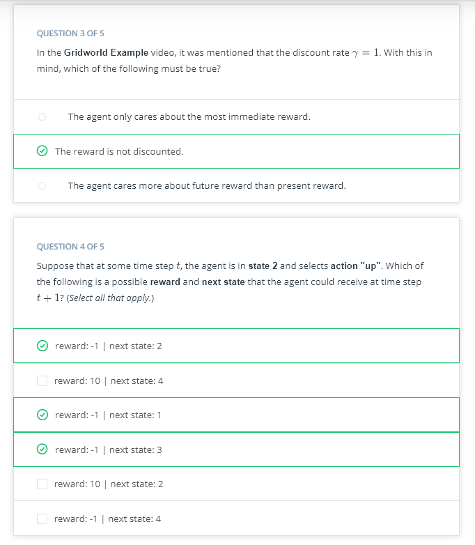
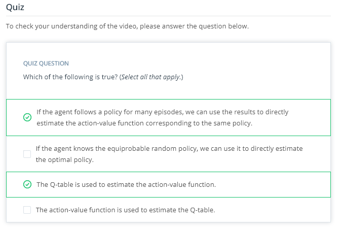
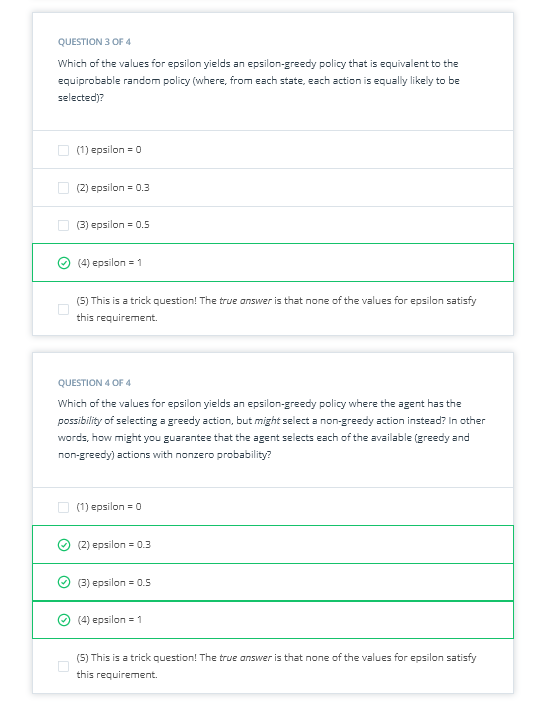

# Monte Carlo Methods

## Concepts
1. [Review](https://www.youtube.com/watch?v=3H5x0lstvmo)
	
1. [Gridworld Example](https://www.youtube.com/watch?v=Lwibg_IfmrA)
	
	
	
1. [Monte Carlo Methods](https://www.youtube.com/watch?v=titaMCRl224)
	
1. [MC Prediction - Part 1](https://www.youtube.com/watch?time_continue=1&v=6ts9gdIS6vg)
	
1. [MC Prediction - Part 2](https://www.youtube.com/watch?v=jR49ZyKuJ98)
	
1. [MC Prediction - Part 3](https://www.youtube.com/watch?v=9LP6uXdmWxQ)
	
	
	
1. OpenAI Gym: BlackJackEnv
	
	
1. Workspace - Introduction
	
1. [Coding Exercise](https://www.youtube.com/watch?v=Pwiqk7Pncgc)
* Coding Exercise
To reference the pseudocode while working on the notebook, you are encouraged to look at this [sheet](https://github.com/udacity/deep-reinforcement-learning/blob/master/cheatsheet/cheatsheet.pdf).
* Download the Exercise
If you would prefer to work on your own machine, you can download the exercise from the [DRLND GitHub repository](https://github.com/udacity/deep-reinforcement-learning).
* Check Your Implementation
Once you have completed the exercise, you can check your solution by looking at the corresponding sections in Monte_Carlo_Solution.ipynb. Watch the video below to see a solution walkthrough!
1. [Greedy Policies](https://www.youtube.com/watch?time_continue=2&v=DH6c-aODML)
	
1. [Epsilon-Greedy Policies](https://www.youtube.com/watch?v=PxJMtlR06MY)
	
	
	
1. MC Control
	
	
1. Exploration vs. Exploitation
	
	
	
1. [Incremental Mean](https://www.youtube.com/watch?v=h-8MB7V1LiE)
	
	
	
1. [Constant-alpha](https://www.youtube.com/watch?v=QFV1nI9Zpoo)
[Constant-alpha 2](https://www.youtube.com/watch?v=LetHoOtNdJc)
	
	
1. [Coding Exercise](https://www.youtube.com/watch?v=6E_3NJcoxmU)
* Coding Exercise
To reference the pseudocode while working on the notebook, you are encouraged to look at this [sheet](https://github.com/udacity/deep-reinforcement-learning/blob/master/cheatsheet/cheatsheet.pdf).
* Download the Exercise
If you would prefer to work on your own machine, you can download the exercise from the [DRLND GitHub repository](https://github.com/udacity/deep-reinforcement-learning).
1. Summary
	
	
	