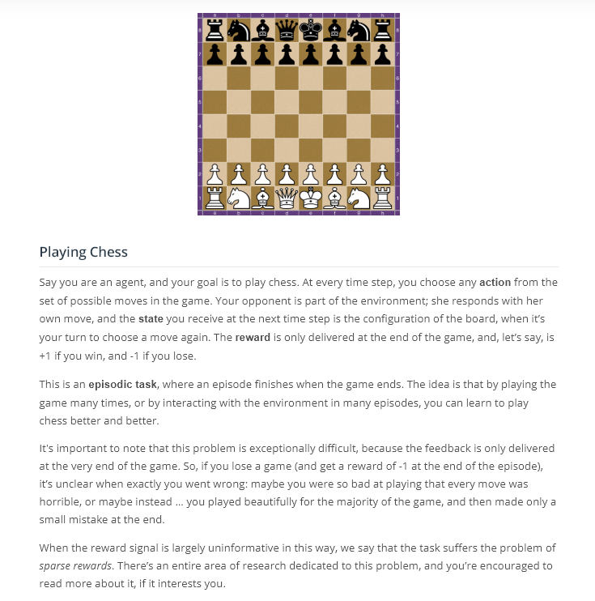
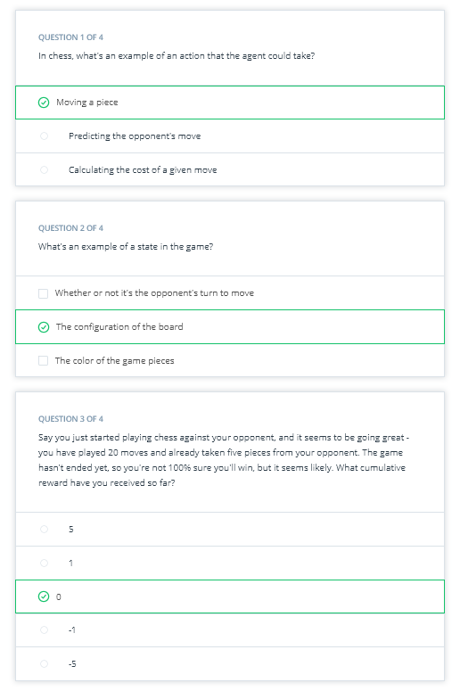
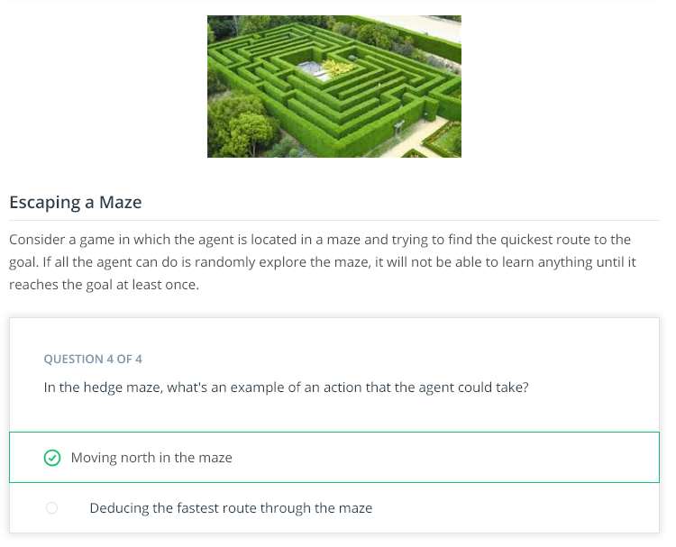
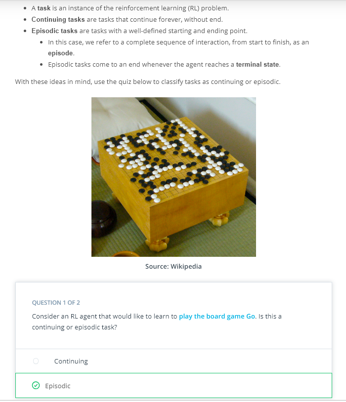
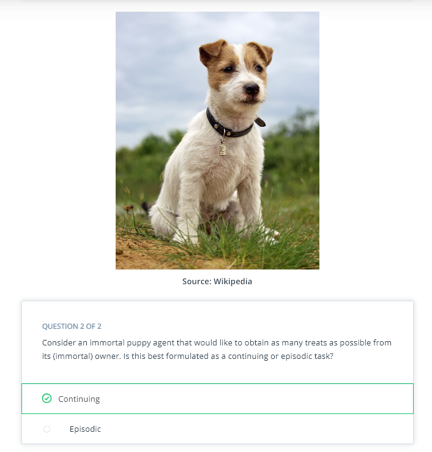
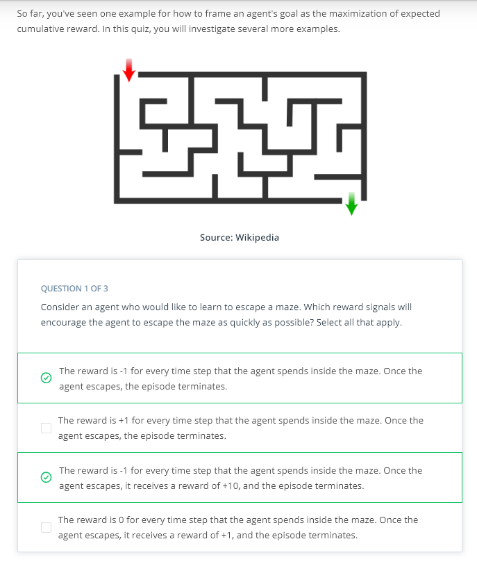
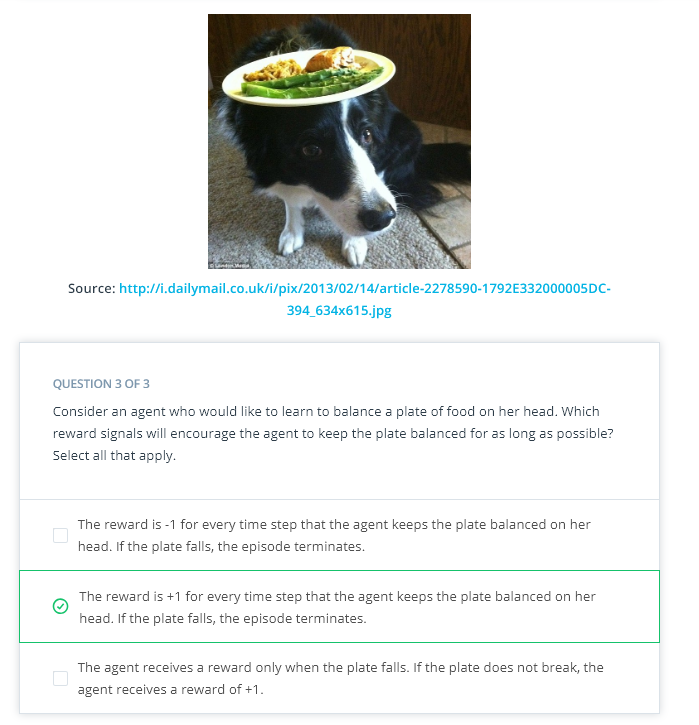

# The RL Framework: The Problem

## Concepts
1. [Introduction](https://www.youtube.com/watch?v=X_9l_ZqXXBA)
1. [The Setting, Revisited](https://www.youtube.com/watch?v=V6Q1uF8a6kA)
1. [Episodic vs. Continuing Tasks](https://www.youtube.com/watch?v=E1I-BPanSM8)
1. Quiz: Test Your Intuition
	
	
	
1. Quiz: Episodic or Continuing?
	
	
1. [The Reward Hypothesis](https://www.youtube.com/watch?v=uAqNwgZ49JE)
1. [Goals and Rewards, Part 1](https://www.youtube.com/watch?v=XPnj3Ya3EuM)
1. 1. [Goals and Rewards, Part 2](https://www.youtube.com/watch?time_continue=1&v=pVIFc72VYH8)
	> If you'd like to learn more about the research that was done at [DeepMind](https://deepmind.com/), please check out [this link](https://deepmind.com/blog/producing-flexible-behaviours-simulated-environments/). The research paper can be accessed [here](https://arxiv.org/pdf/1707.02286.pdf). Also, check out this cool [video](https://www.youtube.com/watch?v=hx_bgoTF7bs&feature=youtu.be)!
1. Quiz: Goals and Rewards
	
	
	
1. [Cumulative Reward](https://www.youtube.com/watch?v=ysriH65lV9o)
1. [Discounted Return](https://www.youtube.com/watch?v=opXGNPwwn7g)