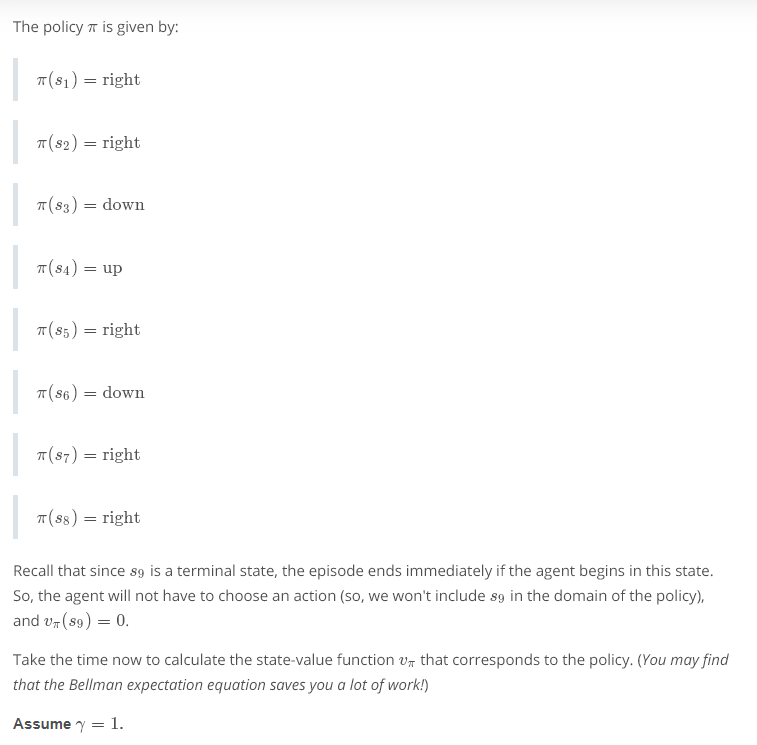

# The RL Framework: The Solution

## Concepts
1. [Introduction](https://www.youtube.com/watch?v=5IlSH-eoPAU)
	> This lesson covers material in Chapter 3 (especially 3.5-3.6) of the [textbook](http://go.udacity.com/rl-textbook).
1. [Policies](https://www.youtube.com/watch?v=hc3LrvaC13U)
1. Quiz: Interpret the Policy
	
	
	
	
	
1. [Gridworld Example](https://www.youtube.com/watch?time_continue=1&v=XeHBmPFqTsE)
1. [State-Value Functions](https://www.youtube.com/watch?v=llakAjwox_8)
	
1. [Bellman Equations](https://www.youtube.com/watch?time_continue=2&v=UgIaDMvSdUo)
	
	
1. Quiz: State-Value Functions
	
	
	
	
	
1. [Optimality](https://www.youtube.com/watch?v=j231aRV74QM)
1. [Action-Value Functions](https://www.youtube.com/watch?v=KJLaRfOOPGA)
1. Quiz: Action-Value Functions
	
1. [Optimal Policies](https://www.youtube.com/watch?v=2rguYpVyCto)
1. Quiz: Optimal Policies
	
	
	
1. Summary
	
	
