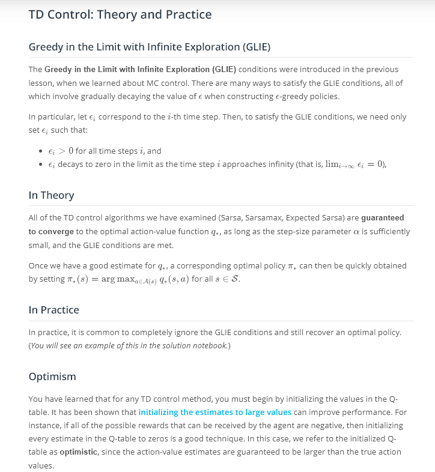

# Temporal Difference Methods

## Concepts
1. [Introduction](https://www.youtube.com/watch?v=yXErXQulI_o)
1. Review: MC Control Methods
	
	
1. [Quiz: MC Control Methods](https://www.youtube.com/watch?v=Lwibg_IfmrA) [2](https://www.youtube.com/watch?time_continue=1&v=ZwIg6LDMyuo)
	
	
1. [TD Control: Sarsa](https://www.youtube.com/watch?v=HYV0SP9wm7g) [2](https://www.youtube.com/watch?v=U_CV-UC9G2c)
	
1. Quiz: Sarsa
	
	
	
1. [TD Control: Q-Learning](https://www.youtube.com/watch?v=4DxoYuR7aZ4)
	
	> Check out this (optional) [research paper](http://citeseerx.ist.psu.edu/viewdoc/download?doi=10.1.1.80.7501&rep=rep1&type=pdf) to read the proof that Q-Learning (or Sarsamax) converges.
1. Quiz: Q-Learning
	
	
1. [TD Control: Expected Sarsa](https://www.youtube.com/watch?v=kEKupCyU0P0)
	
	> Check out this (optional) [research paper](http://citeseerx.ist.psu.edu/viewdoc/download?doi=10.1.1.216.4144&rep=rep1&type=pdf) to learn more about Expected Sarsa.
1. Quiz: Expected Sarsa
	
	
	
1. TD Control: Theory and Practice
	
1. OpenAI Gym: CliffWalkingEnv
	
	
1. Workspace - Introduction
	
1. Coding Exercise
	
1. Analyzing Performance
	
	
1. Quiz: Check Your Understanding
	
	
	
	
	
1. Summary
	
	