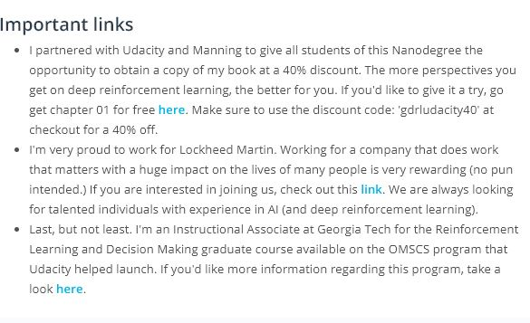
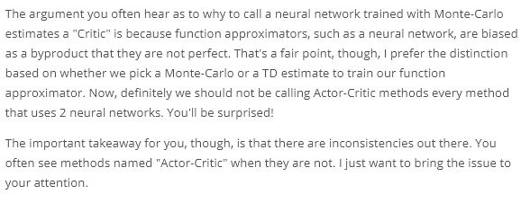
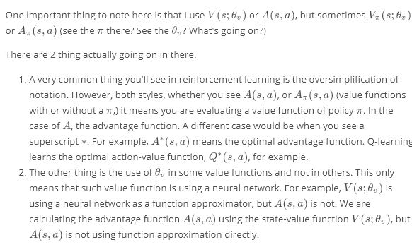
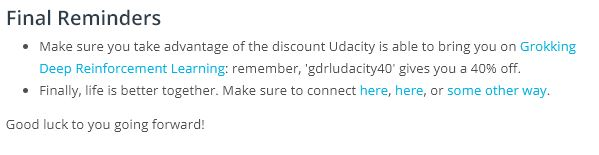

# Actor-Critic Methods

## Contents
1. [Introduction](https://www.youtube.com/watch?v=_OHo1pEaJcQ&feature=emb_logo)
	
	[book](https://www.manning.com/books/grokking-deep-reinforcement-learning?a_aid=gdrl)
	[jobs](https://www.lockheedmartinjobs.com/)
	[course](https://www.omscs.gatech.edu/)
1. [Motivation](https://www.youtube.com/watch?v=dpFPlDtdxyQ&feature=emb_logo)
1. [Bias and Variance](https://www.youtube.com/watch?v=_vnkkwm46uU&feature=emb_logo)
1. [Two Ways for Estimating Expected Returns](https://www.youtube.com/watch?v=2W6yIBDvfsQ&feature=emb_logo)
1. [Baselines and Critics](https://www.youtube.com/watch?v=wqmqoiUuQHI&feature=emb_logo)
	
1. [Policy-based, Value-Based, and Actor-Critic](https://www.youtube.com/watch?v=iyin896PNEc&feature=emb_logo)
1. [A Basic Actor-Critic Agent](https://www.youtube.com/watch?v=KdHQ24hBKho&feature=emb_logo)
	
1. [A3C: Asynchronous Advantage Actor-Critic, N-step](https://www.youtube.com/watch?v=twNXFplIAP8&feature=emb_logo)
1. [A3C: Asynchronous Advantage Actor-Critic, Parallel Training](https://www.youtube.com/watch?v=kKRbAKhjACo&feature=emb_logo)
1. [3C: Asynchronous Advantage Actor-Critic, Off- vs On-policy](https://www.youtube.com/watch?v=AZiy5R0DESU&feature=emb_logo)
1. [A2C: Advantage Actor-Critic](https://www.youtube.com/watch?v=fIWe3xA97DA&feature=emb_logo)
1. [A2C Code Walk-through](https://www.youtube.com/watch?v=LiUBJje2N0c&feature=emb_logo)
1. [GAE: Generalized Advantage Estimation](https://www.youtube.com/watch?v=oLFocWp0dt0&feature=emb_logo)
	
1. [DDPG: Deep Deterministic Policy Gradient, Continuous Action-space](https://www.youtube.com/watch?v=0NVOPIyrr98&feature=emb_logo)
	> In the [DDPG paper](https://arxiv.org/abs/1509.02971), they introduced this algorithm as an "Actor-Critic" method. Though, some researchers think DDPG is best classified as a DQN method for continuous action spaces (along with [NAF](https://arxiv.org/abs/1603.00748)). Regardless, DDPG is a very successful method and it's good for you to gain some intuition.
1. [DDPG: Deep Deterministic Policy Gradient, Soft Updates](https://www.youtube.com/watch?v=RT-HDnAVe9o&feature=emb_logo)
1. [DDPG Code Walk-through](https://www.youtube.com/watch?v=08V9r3NgFSE&feature=emb_logo)
1. [Summary](https://www.youtube.com/watch?v=rRuiMhijw_s&feature=emb_logo)
	
	> Finally, life is better together. Make sure to connect [here](http://bit.ly/mimoralea_t), [here](http://bit.ly/mimoralea_l), or [some other way](http://bit.ly/mimoralea).