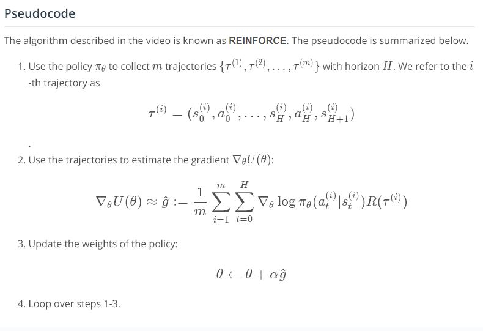

# Policy Gradient Methods

## Concepts
1. [What are Policy Gradient Methods?](https://www.youtube.com/watch?v=ZEhQRASU5O4&feature=emb_logo) 
	
	
1. [The Big Picture](https://www.youtube.com/watch?v=zoOgRoaxGiU&feature=emb_logo)
	
1. [Connections to Supervised Learning](https://www.youtube.com/watch?v=dJz_p4FKE-g&feature=emb_logo) [Blog](http://karpathy.github.io/2016/05/31/rl/)
	
1. [Problem Setup](https://www.youtube.com/watch?v=St9ftvMQ_ks&feature=emb_logo)
	
1. [REINFORCE](https://www.youtube.com/watch?v=o6CI2q3IXEs&feature=emb_logo)
	
	
1. (Optional) Derivation
	
	
	
1. Coding Exercise
	
1. [Workspace](workspace-1544144745.tar.gz)
1. What's Next
	
1. Summary
	
	