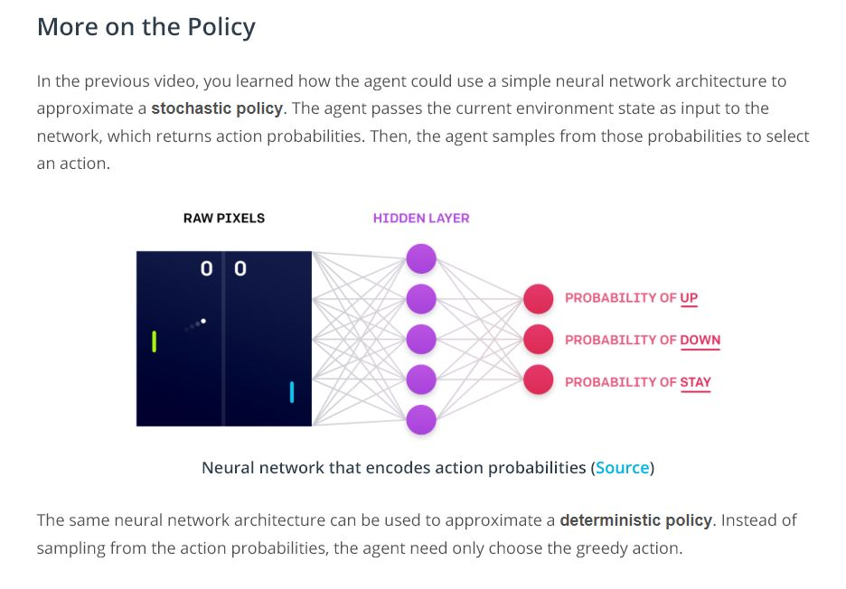
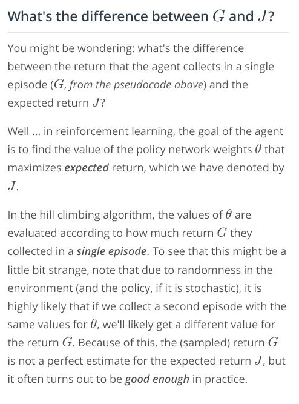

# Introduction to Policy-Based Methods

## Concepts
1. [Policy-Based Methods](https://www.youtube.com/watch?v=mMnhi8yzwKk&feature=emb_logo)
1. [Policy Function Approximation](https://www.youtube.com/watch?v=v8tGjlc2aG4&feature=emb_logo)
1. More on the Policy
	
	
	
	
1. [Hill Climbing](https://www.youtube.com/watch?v=5E86a0OyVyI&feature=emb_logo)
	
1. [Hill Climbing Pseudocode](https://www.youtube.com/watch?v=0XzzqIXyax0&feature=emb_logo)
	
1. [Beyond Hill Climbing](https://www.youtube.com/watch?v=QicxmyE5vTo&feature=emb_logo)
	
1. [More Black-Box Optimization](https://www.youtube.com/watch?v=2poDljPvY58&feature=emb_logo)
	 [Evolution Strategy](https://openai.com/blog/evolution-strategies/)
1. Coding Exercise
	
1. [Workspace](workspace-1544127345.tar.gz)
1. OpenAI Request for Research
	
	
1. Why Policy-Based Methods?](https://www.youtube.com/watch?v=ToS8vXGdODE&feature=emb_logo)
1. Summary
	
	
	
