# Proximal Policy Optimization

## Concepts
1. [Instructor Introduction](https://www.youtube.com/watch?v=sokSgNtGj9Y&feature=emb_logo)
1. [Lesson Preview](https://www.youtube.com/watch?time_continue=1&v=w27mvWFBnvQ&feature=emb_logo)
	> Lesson Preview
	> State-of-the-art RL algorithms contain many important tweaks in addition to simple value-based or policy-based methods. One of these key improvements is called Proximal Policy Optimization (PPO) -- also closely related to Trust Region Policy Optimization (TRPO). It has allowed faster and more stable learning. From developing agile robots, to creating expert level gaming AI, PPO has proven useful in a wide domain of applications, and has become part of the standard toolkits in complicated learning environments.
	> In this lesson, we will first review the most basic policy gradient algorithm -- REINFORCE, and discuss issues associated with the algorithm. We will get an in-depth understanding of why these problems arise, and find ways to fix them. The solutions will lead us to PPO. Our lesson will focus on learning the intuitions behind why and how PPO improves learning, and implement it to teach a computer to play Atari-Pong, using only the pixels as input (see video below). Let's dive in!
	> The idea of PPO was published by the team at OpenAI, and you can read their paper through this [link](https://arxiv.org/abs/1707.06347)
1. Beyond REINFORCE
	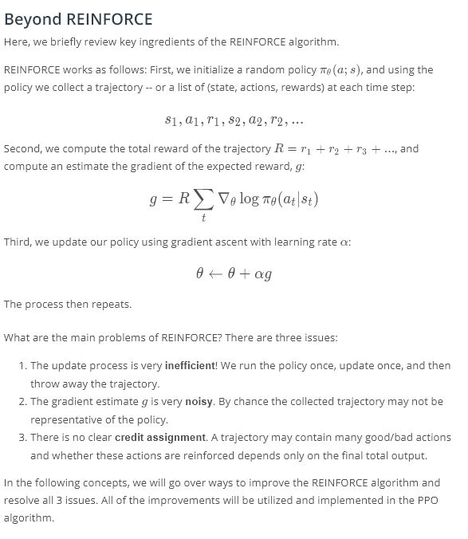
1. [Noise Reduction](https://www.youtube.com/watch?v=GCGqT2knFJ0&feature=emb_logo)
	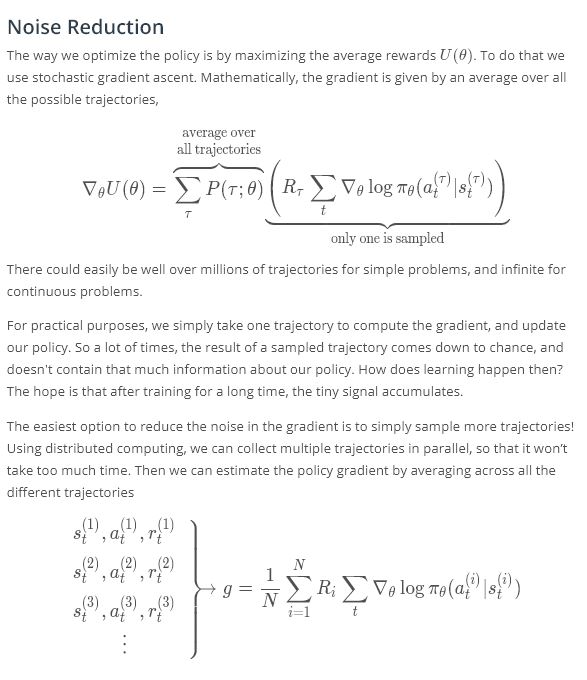
	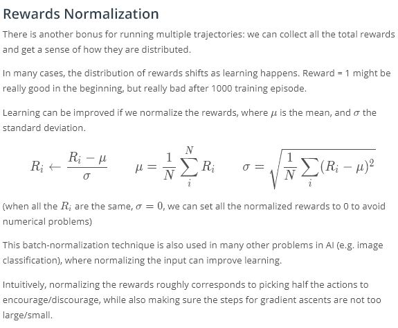
1. [Credit Assignment](https://www.youtube.com/watch?v=tfZw1moB25Y&feature=emb_logo)
	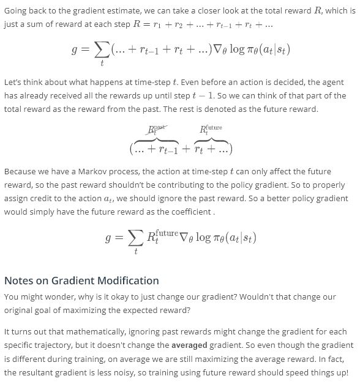
1. Policy Gradient Quiz
	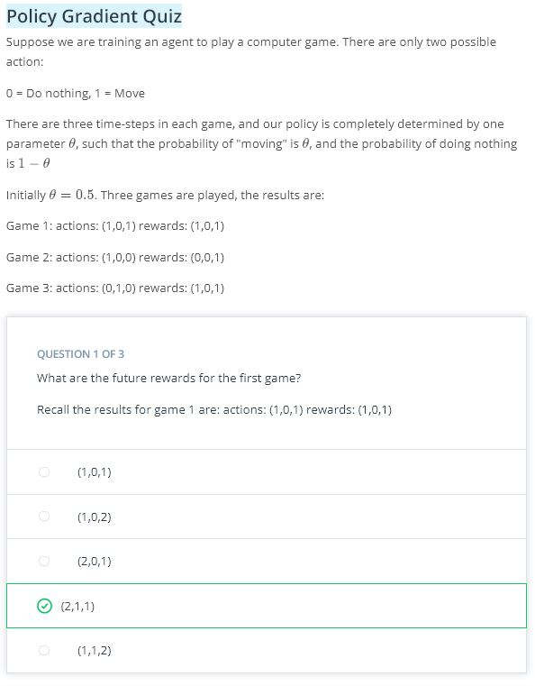
	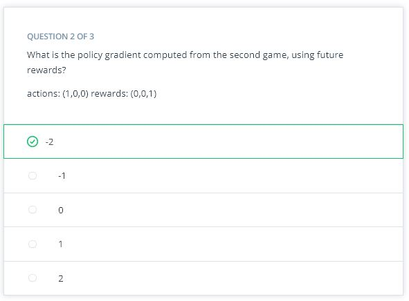
	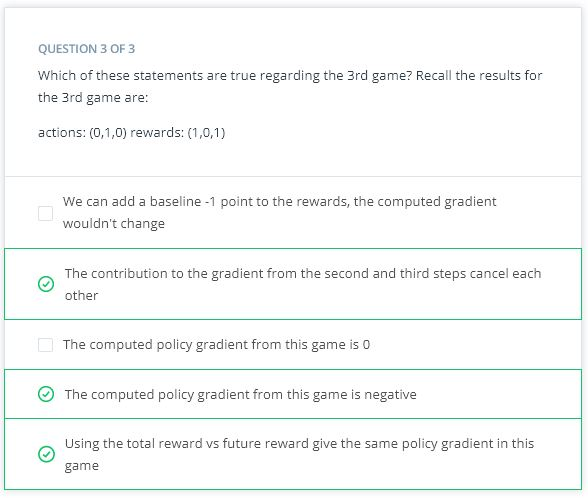
1. [Pong with REINFORCE (code walkthrough)](https://www.youtube.com/watch?v=eKIjPrQWIgg&feature=emb_logo)
	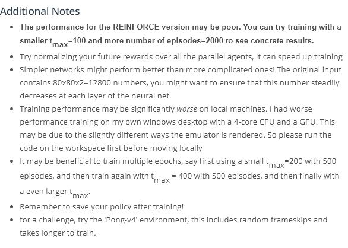
1. [pong with REINFORCE (workspace)](workspace-1544144745.tar.gz)
1. [Importance Sampling](https://www.youtube.com/watch?v=cYPvWriOPIk&feature=emb_logo)
	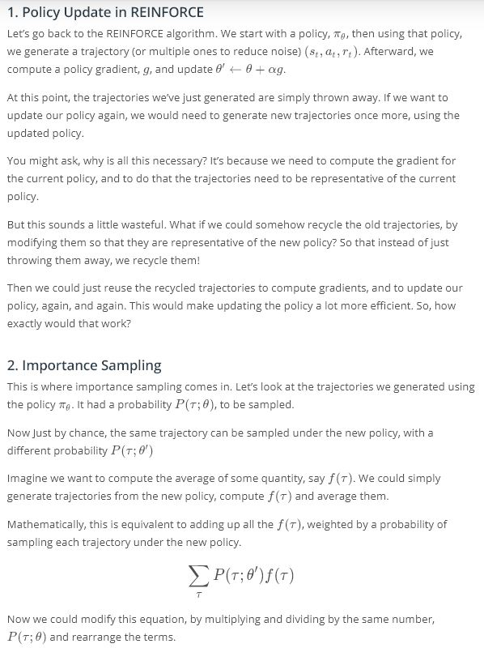
	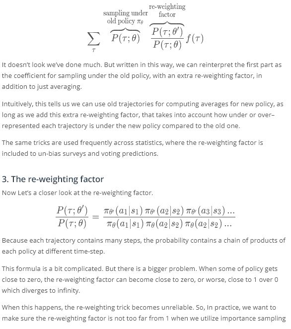
1. [PPO Part 1: The Surrogate Function](https://www.youtube.com/watch?v=Y-boYZlpO7g&feature=emb_logo)
	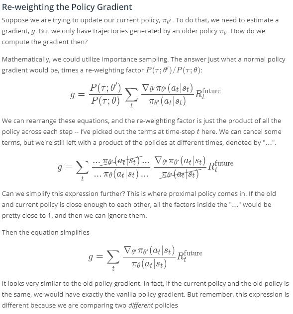
	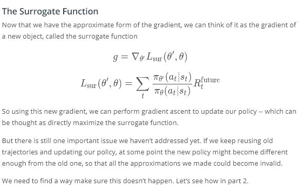
1. [PPO Part 2: Clipping Policy Updates](https://www.youtube.com/watch?v=NRzjGGX6c34&feature=emb_logo)
	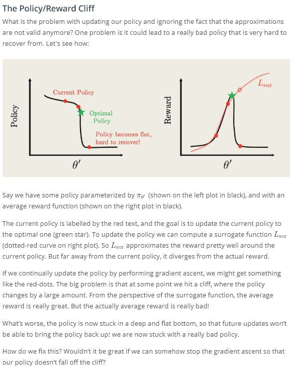
	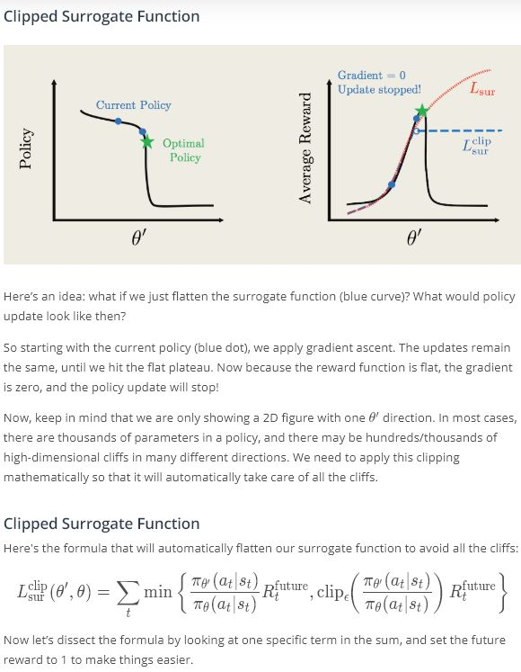
	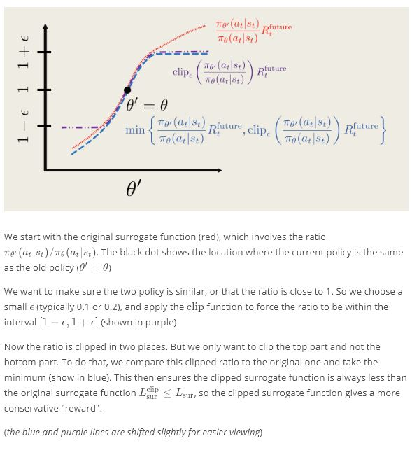
1. [PPO Summary](https://www.youtube.com/watch?v=qRAUAAWA_kc&feature=emb_logo)
	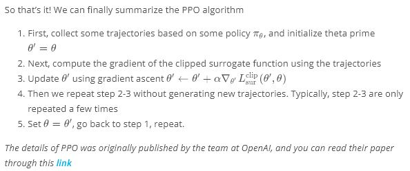
1. [Pong with PPO (code walkthrough)](https://www.youtube.com/watch?v=XhfhR7Z01S0&feature=emb_logo)
	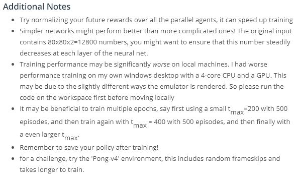
1. [pong with PPO (workspace)](workspace-1544144745.tar.gz)