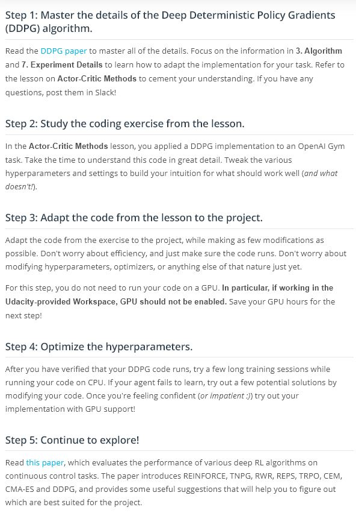

# Continuous Control

## Contents
1. Unity ML-Agents
	
1. The Environment - Introduction
	
	
1. The Environment - Real World
	
	> Watch this [YouTube video](https://www.youtube.com/watch?v=ZVIxt2rt1_4) to see how some researchers were able to train a similar task on a real robot! The accompanying research paper can be found [here](https://arxiv.org/pdf/1803.07067.pdf).
	> In the second version of the project environment, there are 20 identical copies of the agent. It has been shown that having multiple copies of the same agent [sharing experience can accelerate learning](https://ai.googleblog.com/2016/10/how-robots-can-acquire-new-skills-from.html), and you'll discover this for yourself when solving the project!
1. [The Environment - Explore](https://www.youtube.com/watch?v=i2gVvXgOMnc&feature=emb_logo)
	
	
	
	
	
1. Project Instructions
	> To review the detailed project requirements, please read the project [rubric](https://review.udacity.com/#!/rubrics/1890/view).
1. Benchmark Implementation
	
	
	
	> Notes: If you are interested in implementing a method that will be more stable with the project, please explore [this paper](https://arxiv.org/abs/1604.06778). As discussed in the paper, Trust Region Policy Optimization (TRPO) and Truncated Natural Policy Gradient (TNPG) should achieve better performance. You may also like to write your own implementation of Proximal Policy Optimization (PPO), which has also [demonstrated good performance](https://blog.openai.com/openai-baselines-ppo/) with continuous control tasks.
	> You may also like to explore the (very!) recent [Distributed Distributional Deterministic Policy Gradients (D4PG)](https://openreview.net/forum?id=SyZipzbCb) algorithm as another method for adapting DDPG for continuous control.
1. Not sure where to start?
	
	> [DDPG Paper](https://arxiv.org/abs/1509.02971)
	> [Performance](https://arxiv.org/abs/1604.06778)
1. General Advice
	
	> [Doesnot work yet](https://www.alexirpan.com/2018/02/14/rl-hard.html)
1. (Optional) Challenge: Crawl
	
	> [Environment](https://github.com/Unity-Technologies/ml-agents/blob/master/docs/Learning-Environment-Examples.md#crawler)
	> [Macos](https://s3-us-west-1.amazonaws.com/udacity-drlnd/P2/Crawler/Crawler.app.zip)