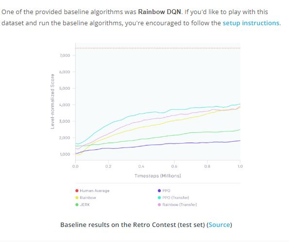

# Deep Q-Network

## Concepts
1. [From RL to Deep RL](https://www.youtube.com/watch?v=7HLJ0uaR1F0&feature=emb_logo)
[Part 2](https://www.youtube.com/watch?time_continue=2&v=WgiAvr7COR0&feature=emb_logo)
	
	
	> Resources
	> Riedmiller, Martin. "Neural fitted Q iteration–first experiences with a data efficient neural reinforcement learning method." European Conference on Machine Learning. Springer, Berlin, Heidelberg, 2005. http://ml.informatik.uni-freiburg.de/former/_media/publications/rieecml05.pdf
	> Mnih, Volodymyr, et al. "Human-level control through deep reinforcement learning." Nature518.7540 (2015): 529. http://www.davidqiu.com:8888/research/nature14236.pdf
1. [Deep Q-Networks](https://www.youtube.com/watch?v=GgtR_d1OB-M&feature=emb_logo)
	
1. [Experience Replay](https://www.youtube.com/watch?v=wX_-SZG-YMQ&feature=emb_logo)
	
1. [Fixed Q-Targets](https://www.youtube.com/watch?v=SWpyiEezfp4&feature=emb_logo)
	
	
1. [Deep Q-Learning Algorithm](https://www.youtube.com/watch?v=MqTXoCxQ_eY&feature=emb_logo)
	> Please take the time now to read the [research paper](https://storage.googleapis.com/deepmind-media/dqn/DQNNaturePaper.pdf) that introduces the Deep Q-Learning algorithm.
	> [Excellent Tips](https://www.huffpost.com/entry/how-to-read-and-understand-a-scientific-paper_b_5501628)
	
1. Coding Exercise
	
1. [Workspace](workspace-1542182985.tar.gz)
1. Deep Q-Learning Improvements
	> Several improvements to the original Deep Q-Learning algorithm have been suggested. Over the next several videos, we'll look at three of the more prominent ones.
	> Double DQN
	> Deep Q-Learning [tends to overestimate](https://www.ri.cmu.edu/pub_files/pub1/thrun_sebastian_1993_1/thrun_sebastian_1993_1.pdf) action values. [Double Q-Learning](https://arxiv.org/abs/1509.06461) has been shown to work well in practice to help with this.
	> Prioritized Experience Replay
	> Deep Q-Learning samples experience transitions uniformly from a replay memory. [Prioritized experienced replay](https://arxiv.org/abs/1511.05952) is based on the idea that the agent can learn more effectively from some transitions than from others, and the more important transitions should be sampled with higher probability.
	> Dueling DQN
	> Currently, in order to determine which states are (or are not) valuable, we have to estimate the corresponding action values for each action. However, by replacing the traditional Deep Q-Network (DQN) architecture with a [dueling architecture](https://arxiv.org/abs/1511.06581), we can assess the value of each state, without having to learn the effect of each action.
1. [Double DQN](https://www.youtube.com/watch?v=PGCEMLujiGI&feature=emb_logo)
	> You can read more about Double DQN (DDQN) by perusing this [research paper](https://arxiv.org/abs/1509.06461).
	> If you'd like to dig deeper into how Deep Q-Learning overestimates action values, please read this [research paper](https://www.ri.cmu.edu/pub_files/pub1/thrun_sebastian_1993_1/thrun_sebastian_1993_1.pdf).
1. [Prioritized Experience Replay](https://www.youtube.com/watch?v=cN8z-7Ze9L8&feature=emb_logo)
	> You can read more about prioritized experience replay by perusing this [research paper](https://arxiv.org/abs/1511.05952).
1. [Dueling DQN](https://www.youtube.com/watch?v=zZeHbPs39Ls&feature=emb_logo)
	> You can read more about Dueling DQN by perusing this [research paper](https://arxiv.org/abs/1511.06581).
1. Rainbow
	> But these aren't the only extensions to the DQN algorithm! Many more extensions have been proposed, including:
	> Learning from [multi-step bootstrap targets](https://arxiv.org/abs/1602.01783) (as in A3C - you'll learn about this in the next part of the nanodegree)
	> [Distributional DQN](https://arxiv.org/abs/1707.06887)
	> [Noisy DQN](https://arxiv.org/abs/1706.10295)
	> Researchers at Google DeepMind recently tested the performance of an agent that incorporated all six of these modifications. The corresponding algorithm was termed [Rainbow](https://arxiv.org/abs/1710.02298).
	
	
	
1. [Summary](https://www.youtube.com/watch?time_continue=3&v=x6JggcDTcys&feature=emb_logo)