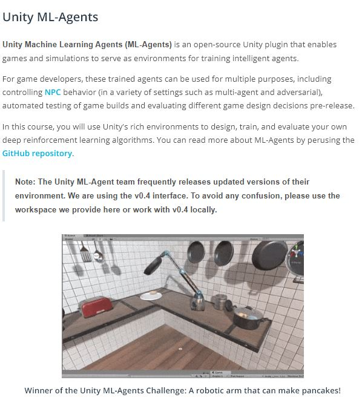
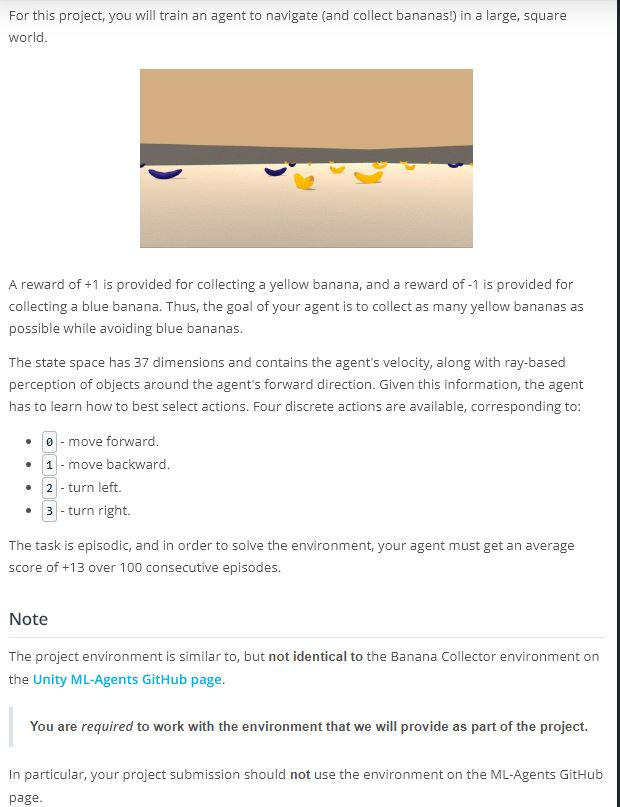
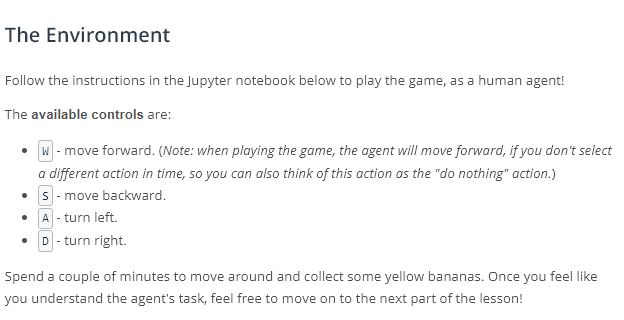
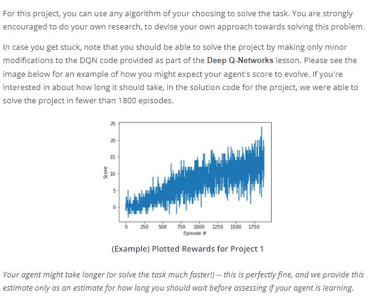
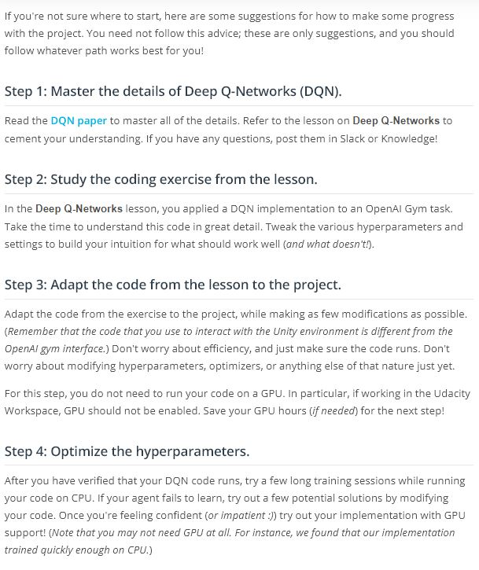

# Project: Navigation

## Concepts
1. Unity ML-Agents
	
1. The Environment
	
1. The Environment - Play
	
1. [The Environment - Explore](https://www.youtube.com/watch?v=ltz2GhFv04A&feature=emb_logo)
	> [MACOS](https://s3-us-west-1.amazonaws.com/udacity-drlnd/P1/Banana/Banana.app.zip)
	> [Own Environment](https://github.com/Unity-Technologies/ml-agents/blob/master/docs/Getting-Started-with-Balance-Ball.md)
1. Benchmark Implementation
	
1. Not sure where to start?
	
1. (Optional) Challenge: Learning from Pixels
	> In the project, your agent learned from information such as its velocity, along with ray-based perception of objects around its forward direction. A more challenging task would be to learn directly from pixels!
	> To solve this environment, you will need to design a convolutional neural network as the DQN architecture. For inspiration about how to set up this architecture, please refer to the [DQN paper](https://storage.googleapis.com/deepmind-media/dqn/DQNNaturePaper.pdf).
	> This task will take much longer to train than the project, and (unless you are very patient :D) you're encouraged to use a GPU to train. If you don't have a local GPU setup, you can learn how to train the project on AWS by following the instructions [here](https://github.com/Unity-Technologies/ml-agents/blob/master/docs/Training-on-Amazon-Web-Service.md). Note that it is not possible to train this agent in the provided Udacity Workspace.
	> [MACOS](https://s3-us-west-1.amazonaws.com/udacity-drlnd/P1/Banana/VisualBanana.app.zip)