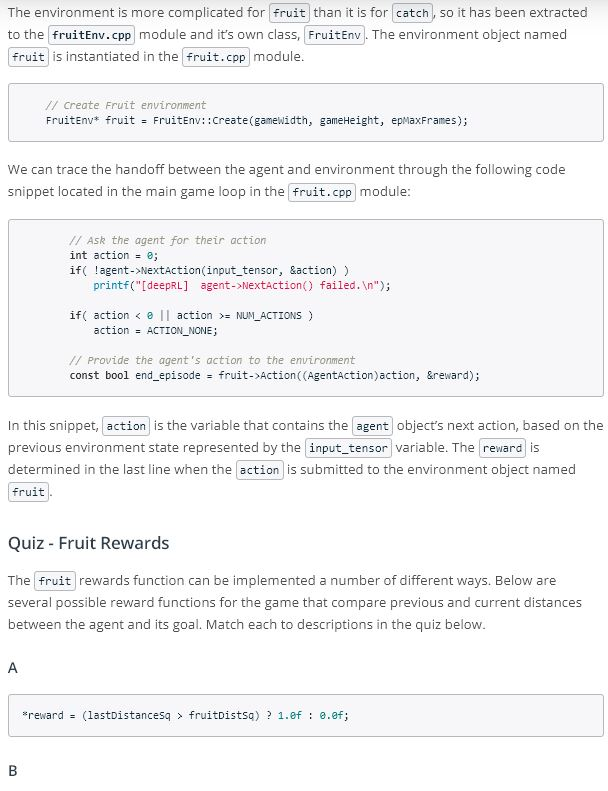

# Deep RL for Robotics

## Concepts
1. [Introduction](https://www.youtube.com/watch?v=dfeawuScC7k&feature=emb_logo)
1. [C++ for Robotics](https://www.youtube.com/watch?v=1oElWzRt-lU&feature=emb_logo)
[Transition](https://www.youtube.com/watch?time_continue=1&v=BvDvxw8e0CY&feature=emb_logo)
	
1. [C/C++ API](https://www.youtube.com/watch?time_continue=1&v=a9-HdpCaYW4&feature=emb_logo)
	
	
	
1. Catch Sample
	
	
	
	
1. [Workspace](workspace-1541247888.tar.gz)
1. Fruit Sample
	
	
	
	
1. Rover Sample
	
	
	
	
1. Arm Sample
	
	
1. [Jetson TX2](https://www.youtube.com/watch?v=M26z7vTti_g&feature=emb_logo)
	
1.[Summary](https://www.youtube.com/watch?time_continue=3&v=cb1FGgZIitc&feature=emb_logo)